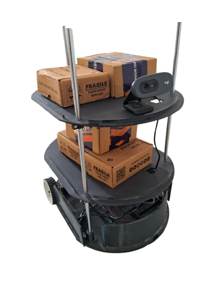
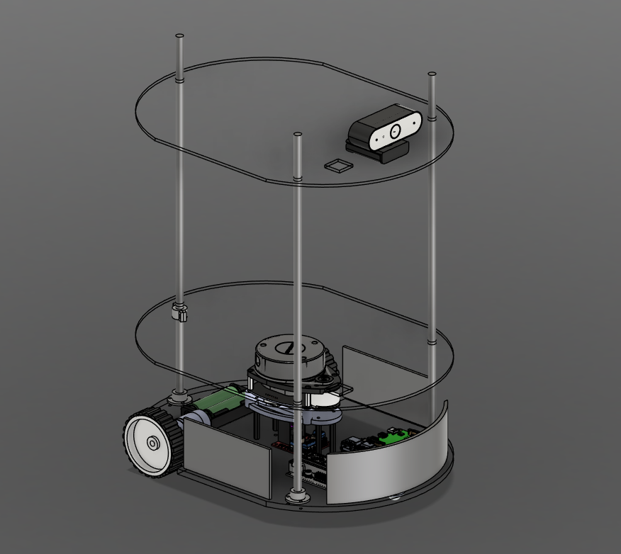

# 🏥 Del_bot: Autonomous Hospital Delivery Robot

[](https://docs.ros.org/en/jazzy/index.html)
[](https://opensource.org/licenses/MIT)
[](https://releases.ubuntu.com/24.04/)

**Del_bot** is an autonomous delivery robot designed to transport medicines, lab samples, and supplies within hospital environments. Built with **ROS 2 Jazzy**, it utilizes SLAM and Nav2 for autonomous navigation, ensuring reliable and contactless delivery in complex indoor layouts.

---

## 📸 Media

| **Hardware Build** | **CAD Design** |
| :---: | :---: |
|  |  |
| *Physical Hardware Implementation* | *Navigating in Hospital Simulation* |

---

## ✨ Features
- 💊 **Autonomous Delivery:** Specialized for hospital corridors and room-to-room transport.
- 🏎️ **Differential Drive:** Precise movement with closed-loop encoder feedback.
- 🗺️ **SLAM Mapping:** Real-time mapping using `SLAM Toolbox`.
- 🚀 **Advanced Navigation:** `Nav2` integration for dynamic path planning and obstacle avoidance.
- 🎮 **Manual Override:** Teleoperation support for emergency or manual control.
- 🌐 **Digital Twin:** Full Gazebo simulation support for testing routes.

---

## 🛠️ System Architecture

### 📟 Hardware Stack
| Component | Description |
| :--- | :--- |
| **Controller** | Arduino Nano (Motor PWM & Encoder feedback) |
| **Microprocessor** | Raspberry Pi / Laptop (Running ROS 2 Jazzy) |
| **Motors** | 2 × N25 DC Motors with high-resolution encoders |
| **Motor Driver** | L298N Dual H-Bridge |
| **Sensors** | 2D LiDAR (RPLIDAR) |
| **Chassis** | Custom differential-drive base with caster wheel |

### 💻 Software Stack
- **OS:** Ubuntu 24.04 LTS
- **Framework:** ROS 2 Jazzy Jalisco
- **Navigation:** Nav2 (Navigation 2 Stack)
- **Mapping:** SLAM Toolbox
- **Simulation:** Gazebo Harmonic

---

## 🚀 Quick Setup

### 1. Installation & Build
```bash
# Clone the repository
git clone [https://github.com/Orcus-nom/REPO.git](https://github.com/Orcus-nom/REPO.git)
cd REPO

# Install dependencies
rosdep update
rosdep install --from-paths src --ignore-src -r -y

# Build the workspace
source /opt/ros/jazzy/setup.bash
colcon build --symlink-install
source install/setup.bash
```
2. Launch Simulation
To test the delivery routes in a virtual hospital environment:

```Bash
ros2 launch del_bot_description simulation.launch.py
```
3. Launch Real Hardware
```Bash
# Start robot base and sensors
ros2 launch del_bot_bringup robot.launch.py
```

# Start Navigation & SLAM
```
ros2 launch del_bot_navigation navigation.launch.py
```
👨‍💻 Author
Shadab Ahmad Khan * Role: Developer & Maintainer

Contributions: Simulation Support, Hardware Integration, Documentation

Email: shadabahmadkhan272@gmail.com

📄 License
This project is licensed under the MIT License - see the LICENSE file for details.
